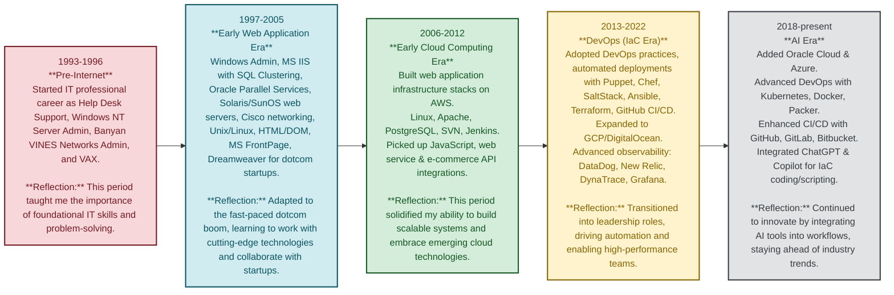

# 🌟 **Virath Sem — DevOps Leader & IT Innovator**

---

Experienced DevOps and Cloud Architect with 15+ years of expertise in building, automating, and scaling cloud-native and hybrid infrastructure. Passionate about enabling high-performance engineering teams, driving platform transformations, and solving complex infrastructure challenges with code and collaboration.

## 🧬 Bio

- Born in 1972 in Cambodia and lived through the Khmer Rouge period.
- Escaped as a refugee and eventually arrived in America in 1980.
- Worked in many different types of jobs from a young age.
- Attended Lowell High School in Massachusetts and Framingham State University (formerly Framingham State College), pursuing a degree in Biology.
- Started working with computers in 1986.
- Landed first professional IT job in 1993 as Help Desk Support at Babson College IT Department.
- Since then, advanced through a wide range of IT roles—including system administrator, database administrator, network engineer, website designer, and more—progressing from engineer and senior engineer to director and VP. In recent years, my focus has been on Cloud architecture, Infrastructure as Code (IaC), and CI/CD automation.

---

## Career Journey

Below is a visual representation of my professional journey, highlighting the evolution of my technical focus and leadership roles across different eras of IT.

[View my full resume &rarr;](./resume.md)

