# 👔 Virath Sem — Resume (Mermaid Timeline)

This graph summarizes my professional journey and the evolution of my technical focus, from early IT roles in the pre-internet era through the web, cloud, DevOps, and AI eras. Each stage highlights the major technologies, platforms, and practices that shaped my career.

```mermaid
timeline
    title Career Timeline

    1993-1996 (Pre-Internet): Started IT professional career as Help Desk Support, Windows NT Server Admin, Banyan VINES Networks Admin, and VAX.
    1997-2005 (Early Web Application Era): Windows Admin, MS IIS with SQL Clustering, Oracle Parallel Services, Solaris/SunOS web servers, Cisco networking, Unix/Linux, and UI languages such as HTML and DOM using tools like MS FrontPage and Dreamweaver for dotcom startups.
    2006-2012 (Early Cloud Computing Era): Built web application infrastructure stacks on AWS running Linux, Apache, PostgreSQL, with SVN and Jenkins. Picked up JavaScript and a wide range of web service and e-commerce API integrations.
    2013-2022 (DevOps IaC Era): Adopted DevOps practices, automated deployments with Puppet, Chef, SaltStack, Ansible, Terraform, and GitHub CI/CD. Expanded to GCP and DigitalOcean. Advanced observability with DataDog, New Relic, DynaTrace, Grafana.
    2018-present (AI Era):  — Added Oracle Cloud Infrastructure and Azure. Advanced DevOps with Kubernetes, Docker, Packer. Enhanced CI/CD with GitHub, GitLab, Bitbucket. Integrated ChatGPT and Copilot prompting for IaC coding/scripting in daily workflow.
```

